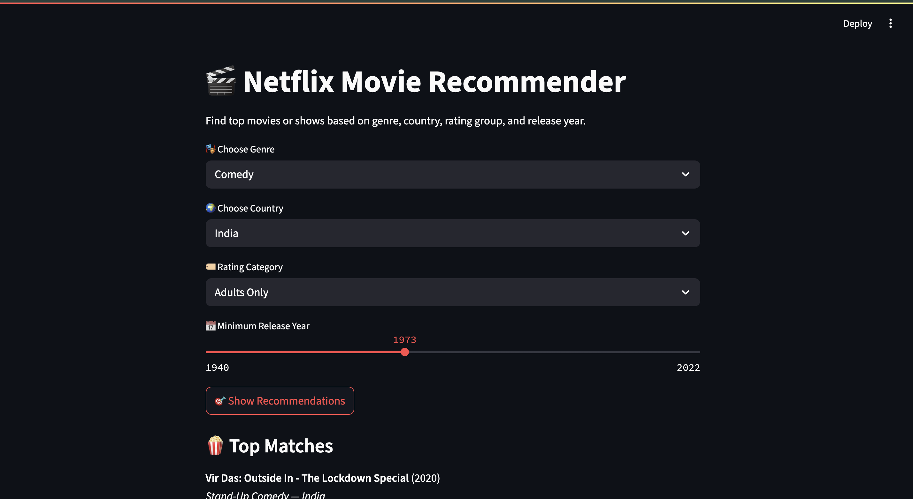

# 🎬 Netflix Movie Recommender (Streamlit App)

An interactive Streamlit-based web app that lets users filter Netflix content based on **Genre, Country, Rating Group**, and **Release Year**. Built using **Python + Pandas + Streamlit** with clean UI and user-friendly design.

---

## 📁 Dataset Used

- Source: [Netflix Titles Dataset on Kaggle](https://www.kaggle.com/datasets/shivamb/netflix-shows)
- File: `netflix_titles.csv`

---

## ✅ Features

- 🎭 Genre-based filtering with curated options (Action, Drama, etc.)
- 🌍 Country filtering from over 80+ countries
- 🏷️ Rating Group (Unrestricted, Youth, Adults Only)
- 📅 Release Year slider (1940–2022)
- 🎯 Shows Top 10 Recommendations dynamically
- 💡 Clean and minimal interface

---

## 🖼️ App Screenshot



---

## 🚀 How to Run Locally

1. **Clone the repository:**

```bash
git clone https://github.com/waheed24-03/netflix-recommender.git
cd netflix-recommender
